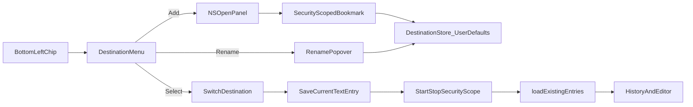

# Named Save Destinations - Plan

## Goal Capsule

- **Objective:** Let a writer keep a few separately named journals in different folders and switch between them from the bottom-left bar in one click, so capturing a quick note lands in the right place without leaving the writing flow.
- **Product authority:** PRODUCT.md local-first Freewrite surface; this plan owns destination pick, name, and switch only. Broader folder-management, cross-destination search/move, and the earlier fuller setup wizard are not active scope.
- **Open blockers:** None.
- **Product Contract preservation:** unchanged

---

## Product Contract

### Summary

Add a bottom-left destination control: choose a folder, give it a display name (defaulting to the folder name), and switch among a small set of destinations via a menu. Switching fully swaps History and where new notes save.

### Problem Frame

Today every note saves under a single fixed folder. Writers who need separate personal and work journals sync or copy that folder elsewhere because they cannot choose a save location in-app. That friction slows the moment of capture this product exists to protect.

### Key Decisions

- **Menu switcher as the primary control** (session-settled: user-directed — chosen over manage panel and split chip: daily switch stays one click; add/rename stay secondary). Governs R1, R4, R5.
- **Smallest v1: pick folder + switch named destinations** (session-settled: user-directed — chosen over fuller Add → Select → Folder → Settings / double-click rebind: enough to replace the sync workaround). Governs R2, R3, R6.
- **Editable display name, defaulting to folder name** (session-settled: user-directed — chosen over folder-name-only labels: friendly names like July without renaming the path). Governs R3.
- **Switch fully swaps the active journal** (session-settled: user-directed — chosen over a mixed all-folders History: personal and work stay cleanly apart). Governs R6, R7.

### Requirements

**Control and destinations**

- R1. The bottom navigation shows the active destination on the left as a quiet folder-affordance plus display name.
- R2. The writer can add a destination by choosing a folder on disk; the new destination becomes available for switching and saving.
- R3. Each destination has an editable display name that defaults to the chosen folder's name.
- R4. Clicking the destination control opens a short menu listing saved destinations, with the active one indicated, and an Add destination action at the bottom.
- R5. Rename is available as a secondary action from that menu (not an always-visible manage panel).

**Journal behavior**

- R6. Choosing a destination in the menu makes it active immediately: History lists only that destination's entries, and new notes save into that destination's folder.
- R7. The existing default Freewrite folder is the first destination so current notes remain reachable without a migration step.
- R8. Destination list, display names, and the active destination persist across app launches.

### Key Flows

- F1. Add destination
  - **Trigger:** Writer chooses Add destination from the menu.
  - **Steps:** App offers a folder picker; writer selects a folder; destination is created with display name defaulting to the folder name; destination appears in the menu.
  - **Outcome:** Writer can switch to the new destination.
  - **Covered by:** R2, R3, R4

- F2. Switch destination
  - **Trigger:** Writer opens the destination menu and chooses another destination.
  - **Steps:** Active destination updates; History reloads for that folder only; subsequent new notes and autosaves use that folder.
  - **Outcome:** Writer is fully in the other journal.
  - **Covered by:** R4, R6

- F3. Rename destination
  - **Trigger:** Writer uses the menu's secondary rename action on a destination.
  - **Steps:** Writer edits the display name; label updates in the chip and menu; folder path is unchanged.
  - **Outcome:** Destination keeps a friendly name independent of the path.
  - **Covered by:** R3, R5

### Acceptance Examples

- AE1. Switch isolates journals
  - **Covers R6, R7.**
  - **Given:** Destinations Personal and Work each have notes; Personal is active.
  - **When:** The writer switches to Work.
  - **Then:** History shows only Work notes, and a new entry saves under Work's folder.

- AE2. Add then rename
  - **Covers R2, R3, R5.**
  - **Given:** The writer adds a folder named `Projects-2026`.
  - **When:** The destination is created, then renamed to `July`.
  - **Then:** The chip and menu show `July`, while files still live in the chosen folder.

- AE3. Default destination on first launch of the feature
  - **Covers R7, R8.**
  - **Given:** The writer already has notes in the default Freewrite folder and has never configured destinations.
  - **When:** They open the app after this feature ships.
  - **Then:** That folder appears as the active destination and their existing History is intact.

### Success Criteria

- A writer can move from "I need Work, not Personal" to writing in Work without leaving the main window or touching Finder.
- Setup of a second destination is a one-time folder pick, not an ongoing sync/copy workaround.
- The control stays Quiet Page–compatible: ink-only, secondary to the writing surface, no accent color or dense chrome.

### Scope Boundaries

**In scope**

- Bottom-left destination chip + menu switcher
- Add destination via folder pick
- Editable display name (default folder name)
- Persist destinations and active selection
- Per-destination History and save path

**Deferred for later**

- Always-visible manage panel or split caret control
- Double-click / one-gesture folder rebinding for an existing destination
- Remove or reorder destinations
- Moving or searching notes across destinations
- Cross-destination History

**Outside this product's identity**

- Turning Freewrite into a full file-browser or multi-vault document manager
- Cloud sync productization beyond "user points at a folder they already sync"

### Deferred to Follow-Up Work

- Document bookmark lifecycle and journal-switch reload under `docs/solutions/` after the feature lands (no solutions corpus exists today).
- Optional later: change-folder for an existing destination when soft-fail is not enough.

### Dependencies / Assumptions

- App sandbox already allows user-selected read-write folders (`freewrite/freewrite.entitlements`). Cross-launch access also requires security-scoped bookmarks and the app-scope bookmarks entitlement (see KTD1).
- Confirmed call-outs from synthesis: default Freewrite folder is the first destination; remove/reorder and change-folder-for-existing-destination wait until after v1.
- Today there is no destination model; storage is a single hard-coded Freewrite documents path (verified in `freewrite/ContentView.swift`).

### Outstanding Questions

**Resolve Before Planning**

- None.

**Deferred to Planning** → resolved in Planning Contract (KTD2–KTD4).

**Deferred to Implementation**

- Exact helper type/file name for destination persistence if extracted from `ContentView`.
- Whether History header path truncation needs a new layout tweak at very narrow window widths.

### Sources / Research

- Grounding: single hard-coded `~/Documents/Freewrite/` path; empty left bottom nav for text; History header reveals that path; only `colorScheme` persisted in UserDefaults today.
- Product/design: `PRODUCT.md`, `DESIGN.md` (Quiet Page; bottom nav as quiet strip; Menu Float whisper shadow).
- Repo research: `documentsDirectory` / `videosDirectory` are immutable `private let`s; both must become active-aware; video playback helpers share those roots; no `NSOpenPanel` / bookmark code today; `freewriteTests` is a stub.
- External (load-bearing): macOS sandbox persistence for user-selected folders requires security-scoped bookmarks (`bookmarkData` / resolve / `startAccessingSecurityScopedResource`), plus recreating bookmarks when stale — path strings alone fail after relaunch.

---

## Planning Contract

### Key Technical Decisions

- KTD1. **Persist user-picked destinations with security-scoped bookmarks** (and add `com.apple.security.files.bookmarks.app-scope` to entitlements). Default Freewrite under the app documents directory stays bookmark-free. Governs R2, R8.
- KTD2. **Missing or unreadable destination soft-fails** (session-settled: user-approved — chosen over force re-pick in v1: keep destination in the list; chip still shows the name; History/load show empty with a quiet failure rather than removing the destination). Governs R6, R8.
- KTD3. **Rename uses a small Quiet Page popover** with a text field, opened from a secondary menu action (session-settled: user-approved — chosen over a system text prompt: matches DESIGN Menu Float; avoids a settings panel). Governs R3, R5.
- KTD4. **Active destination resolves both entry root and `Videos/` subdirectory** so text and video History stay in the same journal. Governs R6.
- KTD5. **Extract a small testable destination store** (model + encode/decode + bookmark resolve helpers) rather than burying all persistence logic only inside `ContentView` view methods. UI wiring stays in `ContentView`.

### High-Level Technical Design

Bookmark lifecycle (directional): pick folder → create bookmark Data with security scope → persist with id/displayName/isDefault → on activate resolve bookmark → if stale, refresh and re-save → `startAccessingSecurityScopedResource` for the session of use → matching `stop` when leaving that destination or tearing down.

### Assumptions

- Writers will keep a small number of destinations (a few journals), so a simple in-memory list + UserDefaults is enough.
- Video recording chrome remains unwired; video *playback* and asset helpers still must follow the active destination's `Videos/` root when present.
- Manual smoke covers `NSOpenPanel` interaction; automated UI tests for the panel are out of v1.

### Sequencing

1. U1 destination model + entitlements + persistence seed
2. U2 active path resolution + switch/reload
3. U3 chip + menu + Add
4. U4 rename popover + missing-folder soft-fail
5. U5 tests + agent docs

---

## Implementation Units

### U1. Destination store, bookmarks entitlement, and default seed

- **Goal:** Persist a list of destinations and the active id across launches, with the default Freewrite folder always available.
- **Requirements:** R7, R8; KTD1, KTD5
- **Dependencies:** None
- **Files:**
  - `freewrite/freewrite.entitlements` (modify)
  - `freewrite/DestinationStore.swift` (create; name may vary)
  - `freewriteTests/DestinationStoreTests.swift` (create)
  - `freewrite.xcodeproj` (ensure new file is in targets)
- **Approach:**
  1. Add app-scope bookmarks entitlement alongside existing user-selected read-write.
  2. Model destination: stable id, displayName, optional bookmark Data, isDefault flag (or equivalent).
  3. Seed default destination from the app documents `Freewrite` URL with no bookmark.
  4. Persist list + active id via UserDefaults (Codable/`Data`), following the existing `colorScheme` persistence style.
  5. Provide create-from-picked-URL (bookmark), resolve/start/stop access, and rename displayName APIs.
- **Patterns to follow:** `UserDefaults` / `@AppStorage` usage in `freewrite/ContentView.swift` and `freewrite/freewriteApp.swift`; keep chrome/data concerns separate from editor typography.
- **Test scenarios:**
  - First launch with empty defaults seeds default Freewrite as active.
  - Encoding/decoding round-trips a user-picked destination's bookmark Data and displayName.
  - Resolving a valid bookmark yields a URL; stale flag path refreshes stored bookmark when resolution reports stale (unit-level with fixture Data where feasible).
  - Renaming updates displayName without changing bookmark payload.
- **Verification:** Unit tests pass for seed + persistence; entitlements file contains bookmarks app-scope key.

### U2. Active-destination path resolution and journal switch

- **Goal:** All load/save/History/video-asset paths follow the active destination; switching fully reloads that journal.
- **Requirements:** R6, R7; KTD4; Covers F2 / AE1 / AE3
- **Dependencies:** U1
- **Files:**
  - `freewrite/ContentView.swift` (modify)
  - `freewriteTests/DestinationStoreTests.swift` or new path-resolution tests (modify/create)
- **Approach:**
  1. Replace immutable `documentsDirectory` / `videosDirectory` constants with getters driven by the active destination (default root vs resolved bookmark URL + `Videos` child). On access, create the active documents root and its `Videos/` child if missing (same create-if-needed behavior today's private-let initializers perform for the default Freewrite paths).
  2. On switch: save current text entry if needed → stop prior security scope → start new scope → clear selection/video URL/thumbnail memory cache → `loadExistingEntries()` so existing launch-selection rules apply inside the new folder.
  3. History Finder reveal continues to use `getDocumentsDirectory()` so it shows the active journal.
- **Patterns to follow:** Existing `loadExistingEntries` / `saveEntry` / sidebar save-before-switch; main-thread `entries` assignment; `hasVideoAsset` legacy lookup order under the active roots.
- **Execution note:** Prefer characterization-style unit coverage of path resolution before rewriting the `private let` roots.
- **Test scenarios:**
  - Covers AE3. With only default seeded, resolved documents URL matches app documents `Freewrite`.
  - Covers AE1. After activating a second destination fixture, resolved documents/videos URLs point under that destination; History load input path is that root.
  - Switching stops access on the previous scoped URL and starts access on the next (helper-level expectations).
- **Verification:** Build succeeds; switching destinations in a debug run shows different History sets and saves new `.md` files into the selected folder.

### U3. Bottom-left chip, menu switcher, and Add destination

- **Goal:** Quiet Page chip + menu for switch and Add (folder picker).
- **Requirements:** R1, R2, R4; Covers F1
- **Dependencies:** U1, U2
- **Files:**
  - `freewrite/ContentView.swift` (modify)
- **Approach:**
  1. Place folder icon + display name left of the bottom-nav `Spacer`, using existing nav hover/cursor/`plain` button patterns (system 13px chrome).
  2. Use SwiftUI `Menu` (or equivalent) listing destinations with active indication; footer action Add destination.
  3. Add opens `NSOpenPanel` for directories; on success create destination (displayName = folder lastPathComponent) and optionally activate it.
  4. Keep chip visible in video playback mode; do not replace `Copy Transcript` when present—share the left cluster without crowding.
- **Patterns to follow:** Bottom nav strip (~40pt, ink-only, `•` separators on the right utilities); DESIGN Menu Float whisper shadow for floating chrome; no accent color.
- **Test scenarios:**
  - Test expectation: none for panel UI automation — covered by manual smoke; model create-from-URL covered in U1.
- **Verification:** Manual: Add a folder, see it in the menu, select it, History swaps; chip label updates.

### U4. Rename popover and missing-destination soft-fail

- **Goal:** Secondary rename and calm failure when a saved destination cannot be accessed.
- **Requirements:** R3, R5; KTD2, KTD3; Covers F3 / AE2
- **Dependencies:** U1, U3
- **Files:**
  - `freewrite/ContentView.swift` (modify)
  - `freewrite/DestinationStore.swift` (modify as needed)
- **Approach:**
  1. Menu secondary action Rename opens a small popover (whisper shadow) with a text field prefilled with the current displayName; commit updates store + chip.
  2. If resolve/startAccess fails for a non-default destination: keep it listed; show empty History; chip remains labeled; do not crash or auto-delete.
  3. Default destination access failures (disk issues) follow the same calm empty state.
- **Patterns to follow:** DESIGN flat surfaces + popover-only shadow; avoid persistent form chrome ("Inputs / Fields: None" in DESIGN — ephemeral rename only).
- **Test scenarios:**
  - Covers AE2. Rename API changes displayName only.
  - Activating a destination whose bookmark resolve fails returns a soft-fail status the UI can bind without removing the destination from the list.
- **Verification:** Manual rename updates chip; quitting with a deleted/moved folder still shows the destination name and empty History after relaunch.

### U5. Agent docs sync and build verification

- **Goal:** Keep agent-facing storage docs accurate; confirm Debug build.
- **Requirements:** R7, R8 (documentation of persistence)
- **Dependencies:** U1–U4
- **Files:**
  - `AGENTS.md` (modify)
  - `CLAUDE.md` (modify; keep in sync with AGENTS.md)
- **Approach:**
  1. Document destinations: UserDefaults keys concept, default Freewrite seed, user-picked folders via bookmarks, bottom-left menu, History scoped to active destination.
  2. Note Videos live under each destination's `Videos/` directory.
  3. Build with the freewrite scheme.
- **Test scenarios:**
  - Test expectation: none -- documentation and build smoke only.
- **Verification:** `AGENTS.md` and `CLAUDE.md` match; Debug build succeeds.

---

## Verification Contract

- Unit: `xcodebuild -project freewrite.xcodeproj -scheme freewrite -destination 'platform=macOS' test` (or equivalent host destination) covering `DestinationStore` / path-resolution tests.
- Build: `xcodebuild -project freewrite.xcodeproj -scheme freewrite -configuration Debug build`
- Manual smoke: Add destination → rename → switch → write note → quit/relaunch → confirm persistence and journal isolation; delete/move a picked folder and confirm soft-fail.

---

## Definition of Done

- R1–R8 satisfied for the settled menu-switcher v1.
- U1–U5 complete with listed verifications.
- Default Freewrite journal unchanged for writers who never add destinations (AE3).
- No accent color or manage-panel chrome introduced.
- Product Contract IDs preserved; agent docs updated for the new storage model.
